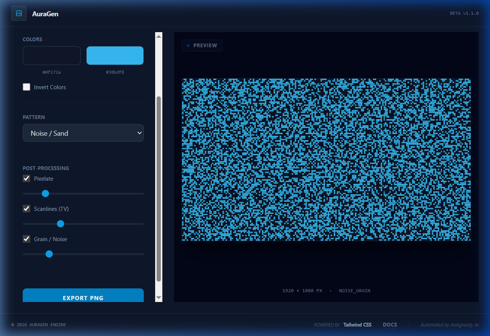

# AuraGen - Dynamic Background Engine



A professional, dynamic background generator built with React and Tailwind CSS v4. Create high-resolution custom backgrounds with procedural patterns and post-processing effects.

## 🚀 Quickstart

To get the project running locally in under 30 seconds:

1. **Clone and Install**
   ```bash
   git clone <your-repo-url>
   cd background_generator
   npm install
   ```

2. **Run Dev Server**
   ```bash
   npm run dev
   ```
   Open [http://localhost:5173](http://localhost:5173) in your browser.

## ✨ Key Features

- **Procedural Patterns**: Checkerboard, Dots, Geometric Shapes, and Noise/Sand.
- **Post-Processing**: Real-time Pixelate, Scanlines, and Noise/Grain overlays.
- **Custom Resolution**: Preset for 1080p, 4K, Mobile, and Ultrawide, plus free-form pixel input.
- **One-Click Export**: High-quality PNG downloads directly from the engine.
- **Minimalist UI**: Clean, professional dark theme for focused creation.

## 🛠️ Tech Stack

- **React 19**
- **Tailwind CSS v4**
- **Vite 7**
- **HTML5 Canvas API** (Core rendering engine)

## 📦 Deployment

This project is configured to deploy automatically to **GitHub Pages** via GitHub Actions. Simply push to the `main` branch, and your site will be updated at:
`https://<username>.github.io/background_generator/`

---
*Automatically generated by Antigravity AI. Powered by Tailwind CSS.*
